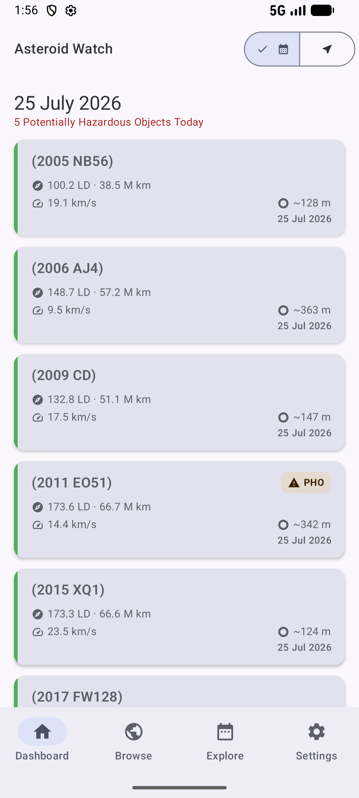
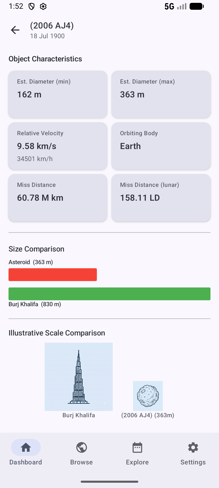

# NeoExplorer

NeoExplorer is an Android app for exploring **Near-Earth Objects (NEOs)** — asteroids and comets that orbit close to Earth. Powered by [NASA's NeoWs API](https://api.nasa.gov/), it lets you browse upcoming close approaches, investigate individual asteroids, and explore the solar system's neighbourhood across any date range.

---

## Screenshots

| Dashboard                                     | Asteroid Details                                     |
|-----------------------------------------------|------------------------------------------------------|
|  |  |

---

## Features

- **Dashboard** — See all asteroids making a close approach over the next 7 days, sortable by date or miss distance, with a count of potentially hazardous objects highlighted at a glance.
- **Browse** — Page through NASA's entire NEO catalogue and discover the full database of known asteroids.
- **Temporal Explorer** — Pick any custom start and end date to explore which asteroids were (or will be) passing by Earth during that period.
- **Asteroid Details** — Dive deep into individual asteroids: estimated diameter, relative velocity, miss distance, orbiting body, hazard status, and a direct link to the NASA JPL page.
- **Settings** — Switch between Light, Dark, or system-default theme, with optional dynamic (Material You) colours.

---

## Getting an API Key

NeoExplorer requires a free NASA API key.

1. Visit **[https://api.nasa.gov/](https://api.nasa.gov/)**.
2. Fill in the short sign-up form under **"Generate API Key"**.
3. Your key will be shown on screen — copy it.
4. Copy the template file and fill in your key:

   ```bash
   cp certs/keys.properties.template certs/keys.properties
   ```

   Then open `certs/keys.properties` and replace the placeholder:

   ```properties
   nasa_api_key=YOUR_API_KEY_HERE
   ```

> **Note:** NASA provides a `DEMO_KEY` with limited rate limits (30 requests/hour, 50/day) if you want a quick test run before registering.
>
> **⚠️ `certs/keys.properties` is not tracked by version control — never commit your API key.**

---

##  Tech Stack

| Layer | Technology |
|-------|-----------|
| Language | Kotlin |
| UI | Jetpack Compose + Material 3 |
| Architecture | [Circuit](https://github.com/slackhq/circuit) (Presenter / UI pattern) |
| Networking | Retrofit 3 + OkHttp 5 |
| Serialization | Kotlinx Serialization (JSON) |
| Dependency Injection | Metro |
| Persistence | DataStore + Protocol Buffers |
| Pagination | AndroidX Paging 3 |
| Date & Time | Kotlinx-datetime |
| Build System | Gradle (Kotlin DSL) with convention plugins |

---

##  Project Structure

The project follows a **multi-module** architecture:

```
NeoExplorer/
├── app/                        # Application entry point
├── core/
│   ├── clock/                  # Abstraction over system time
│   ├── dispatcher/             # Coroutine dispatcher bindings
│   └── formatter/              # Shared formatting utilities
├── data/
│   ├── neo/                    # NASA NeoWs API client & repository
│   └── preferences/            # User preferences (theme, etc.)
└── ui/
    ├── feature/
    │   ├── dashboard/           # 7-day close-approach feed
    │   ├── browse/              # Full NEO catalogue browser
    │   ├── temporalexplorer/    # Custom date-range explorer
    │   ├── details/             # Individual asteroid details
    │   ├── home/                # Root navigation host
    │   └── settings/            # App settings screen
    └── shared/
        ├── asteroid/            # Asteroid UI models, components & feed→UI mapper
        ├── compose/             # Generic reusable Compose utilities & components
        ├── errormessage/        # Throwable → user-facing message mapping
        └── styles/              # Themes & design tokens
```

---

## Getting Started

1. **Clone the repository**

   ```bash
   git clone https://github.com/your-username/NeoExplorer.git
   cd NeoExplorer
   ```

2. **Add your NASA API key** to `certs/keys.properties` (see [Getting an API Key](#-getting-an-api-key) above).

3. **Open in Android Studio** (Ladybug or newer recommended) and let Gradle sync.

4. **Run** the `app` configuration on an emulator or physical device running Android 8.0+.

---

## License

This project is licensed under the terms found in the [LICENSE](LICENSE) file.
